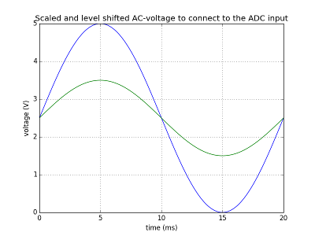

# True RMS Library for Arduino v1.3
This repository contains the *TrueRMS* C++ library for Arduino. With this library it is possible to calculate the *average* value and the *rms* (root mean square) or *effective* value of the ADC input  signal. This library also calculates the *real-*, *apparent power* and the *power factor* from both, voltage and current input signals. From version 1.3, energy metering has been added to the project.

The voltage and the voltage representation of a current can be measured with the ADC of the Arduino by using appropriate input circuitry for scaling the measured quantities down to within the 0-5V compliant voltage range of the ADC. The provided solution uses a simple method for scaling the measured quantities. The user only has to define the full scale peak-to-peak value of the AC input voltage and current. When the units of the measured quantities are defined in Volts and Amperes, then the calculated power is in Watt and the energy in Ws (Joules). This library is easy portable to other platforms.

## Function
The following library classes are implemented:

* `Average`
* `Rms`
* `Rms2`
* `Power`
* `Power2`

*Average* calculates the average value from a number of input samples (usually) from the ADC. *Rms* or *Rms2* is meant to calculate the root-mean-square value of a signal and *Power* or *Power2* is meant to calculate the power from both voltage and current input.

*Rms2* and *Power2* are performing better when used in an interrupt service routine by spreading out the processing burden over the sample time slots. The number of samples for one RMS acquisition run (scan) is defined as *window*. *Rms2* and *Power2* occupy one extra sample time slot (window length +1) when the automatic baseline restoration option is on (BLR_ON).

The following methods exist:

* `begin()`
* `start()`
* `stop()`
* `update()`
* `update1()`
* `update2()`
* `publish()`

## Usage
**For a quick start, check the example Arduino sketches that come with the library.**

These are the steps to follow for a successful implementation:

1. Initialize an instance of a class as defined above with the member function `begin()`. This method is for initializing and it needs input to set the scaling of the measurement units, the size of the sampling window, the number of bits of the used ADC (or input signal) and the acquisition mode (continuous scan/single scan).
2. call `start()` to start the acquisition.
3. call `update()` (or `update1()` + `update2()` for `Power2`) repeatedly at a constant rate.
4. call `publish()` to obtain the results.

For the `Power2` class update() is broken down into `update1()` and `update2()`. `update1()` must be called first to process the sample from the input voltage and `update2()` to process the sample from the input current or vica versa(voltage-current). Sampling voltage and current usually happens in sequence for a multiplexed ADC.

#### Average
For the class *Average* use:

`void begin(float range, unsigned char window, unsigned char nob, bool mode);`

With:

- `range` is the maximum expected full swing of the ac input signal (peak-to-peak value).
- `window` the length of the sample window, expressed in a whole number of samples.
- `nob` is the bit resolution of the input signal (ADC bit depth). Use the predefined constants: `ADC_8BIT`, `ADC_10BIT` or `ADC_12BIT`.
- `mode` sets the mode to continuous scan or single scan. Use the predifined constants `CNT_SCAN` or `SGL_SCAN`.

`void start(void);`
This method starts the acquisition for continuous scan and single scan mode.

`void stop(void);`
This method stops the acquisition.

`void update(int instVal);`
Assign the current sample value.

`void publish(void);`
Publish the result(s) from the last completed acquisition run. The results are in the output variable(s) as defined next.

The public defined variables are:

`int instVal` - the value of the last acquired sample

`float average` - the average value result

`bool acquire` -  status bit, TRUE when scan is pending.

#### Rms or Rms2
For the class *Rms* or *Rms2* use:

`void begin(float range, unsigned char window, unsigned char nob, bool blr, bool mode);`

With:

- `range` is the maximum expected full swing of the ac-signal (peak-to-peak value).
- `window` the length of the sample window expressed in a whole number of samples.
- `nob` is the bit resolution of the input signal, usually this is the ADC bit depth. Use the predefined constants: `ADC_8BIT`, `ADC_10BIT` or `ADC_12BIT`.
- `blr` sets the automatically baseline restoration function on or off. Use the predifined constants `BLR_ON` or `BLR_OFF`.
- `mode` sets the mode to continuous scan or single scan. Use the predifined constants `CNT_SCAN` or `SGL_SCAN`.

`void start(void);`
This method starts the acquisition for continuous scan and single scan mode.

`void stop(void);`
This method stops the acquisition.

`void update(int instVal);`
Assign the current sample value.

`void publish(void);`
Publish the result(s) from the last completed acquisition run. The results are in the output variable(s) as defined next.

The public defined variables are:

`int instVal` - the value of the last acquired sample, restored to the baseline when BLR_ON

`float rmsVal` - the rms value result

`int dcBias` - the dcBias value in ADC-units. Only relevant when BLR_ON

`bool acquire` - status bit, TRUE if scan is pending

#### Power
For the class *Power* use:

`void begin(float range1, float range2, unsigned char window, unsigned char nob, bool blr, bool mode);`

With:

- `range1, range2` is the maximum expected full swing of the ac-signals (peak-to-peak value) of the voltage and current.
- `window` the length of the sample window expressed in a whole number of samples.
- `nob` is the bit resolution of the input signal, usually this is the ADC bit depth. Use the predifined constants: `ADC_8BIT`, `ADC_10BIT` or `ADC_12BIT`.
- `blr` sets the automatically baseline restoration function on or off. Use the predifined constants `BLR_ON` or `BLR_OFF`.
- `mode` sets the mode to continuous scan or single scan. Use the predifined constants `CNT_SCAN` or `SGL_SCAN`.

`void start(void);`
This method starts the acquisition for continuous scan and single scan mode.

`void stop(void);`
This method stops the acquisition.

`void update(int instVal1, int instVal2);`
Assign the current sample values (for example voltage and current) at once.

`void publish(void);`
Publish the result(s) from the last completed acquisition run. The results are in the output variable(s) as defined next.

The public defined variables are:

`int instVal1` - the value of the last acquired sample (voltage), restored to the baseline when BLR_ON

`int instVal2` - the value of the last acquired sample (current), restored to the baseline when BLR_ON

`float rmsVal1` - RMS value1 (voltage)

`float rmsVal2` - RMS value2 (current)

`int dcBias1` - the dcBias1 value in ADC-units. Only relevant when BLR_ON

`int dcBias2` - the dcBias2 value in ADC-units. Only relevant when BLR_ON

`float apparentPwr` - the apparent power

`float realPwr` - real power

`float pf` - power factor

`float energy` - netto energy

`bool acquire` - status bit, TRUE if scan is pending

#### Power2
For the class *Power2* use:

`void begin(float range1, float range2, unsigned char window, unsigned char nob, bool blr, bool mode);`

With:

- `range1, range2` is the maximum expected full swing of the ac-signals (peak-to-peak value) of the voltage and current.
- `window` the length of the sample window expressed in a whole number of samples.
- `nob` is the bit resolution of the input signal, usually this is the ADC bit depth. Use the predifined constants: `ADC_8BIT`, `ADC_10BIT` or `ADC_12BIT`.
- `blr` sets the automatically baseline restoration function on or off. Use the predifined constants `BLR_ON` or `BLR_OFF`.
- `mode` sets the mode to continuous scan or single scan. Use the predifined constants `CNT_SCAN` or `SGL_SCAN`.

`void start(void);`
This method starts the acquisition for continuous scan and single scan mode.

`void stop(void);`
This method stops the acquisition.

`void update1(int instVal);`
Assign the current sample value for example for the voltage.

`void update2(int instVal);`
Assign the current sample value for example for the current.
Call `update1()` and `update2()` alternately in the sampling loop.

`void publish(void);`
Publish the result(s) from the last completed acquisition run.
The results are available from the output variable(s) as defined next.

The public defined variables are:

`int instVal1` - the value of the last acquired sample (voltage), restored to the baseline when BLR_ON

`int instVal2` - the value of the last acquired sample (current), restored to the baseline when BLR_ON

`float rmsVal1` - RMS value1 (voltage)

`float rmsVal2` - RMS value2 (current)

`int dcBias1` - the dcBias1 value in ADC-units. Only relevant when BLR_ON

`int dcBias2` - the dcBias2 value in ADC-units. Only relevant when BLR_ON

`float apparentPwr`, the apparent power

`float realPwr` - real power

`float pf` - power factor

`float energy` - netto energy

`bool acquire` - status bit, TRUE if scan is pending

## Application example
* First create an instance of the library object, for example we define *gridVolt*:
```
Rms gridVolt;
```
* Initialize *gridVolt* at some place in your setup function:
```
void setup() {
	...
	gridVolt.begin(700, 40, ADC_10BIT, BLR_ON, CNT_SCAN);`
	...
}
```
The arguments mean:

The full ADC range (0 to 5Volts) represents a signal peak-to-peak value of 700V. This equals a signal amplitude of 350V or 247.5Vrms for a sine-wave.

The rms window is 40 samples, which means that the window covers two 50Hz cycles, when the sampling rate was chosen at 1000 samples/sec.

The ADC bit resolution is 10bit (Arduino UNO).

BLR_ON means that the baseline restoration is switched on. To capture an AC-signal with the ADC, the zero value of the signal must be shifted towards the mid point of the ADC-range by adding a DC-offset voltage with the ADC input circuitry. This offset must be corrected afterwards in software by subtracting a constant value from the acquired ADC value. This correction can be done automatically with BLR_ON and calibration is not needed.
In figure 1, the blue line indicates the maximum scaled input signal with a voltage swing of 5V and biased on 2.5V. The green line shows an input signal with an amplitude of 1V and measures 1V/sqrt(2) = 0.71Vrms.



With the option CNT_SCAN, the acquisition is set in the continous mode. The acquisition will restart automatically after completing the last scan.

 * Call `gridVolt.update(adcVal);` from the main loop or from an Interrupt Service Routine (ISR). Make sure that the loop repeats at a constant rate.
 
 * Get the results with `gridVolt.publish()` and obtain the rms value: `float Voltage = gridVolt.rmsVal;`
 
``` 
void loop() { // loop must run at 1kHz
	...
	adcValue = analogRead(AN0); // read the ADC.
	gridVolt.update(adcValue);
	
	counter++;
	if(counter >= 500) { // publish every 0.5s
	gridVolt.publish();
	Voltage = gridVolt.rmsVal;
	counter = 0;
	}
	...
	while(loop_timer_not_expired) {1}
	...
}
```

## Example Arduino Sketches
`Measure_avg.ino` - This example shows how to calculate the average value of a signal measured with the ADC.

`Measure_rms.ino` -  In this example the RMS-value of the ADC input voltage is determined. 

`AC_powermeter.ino` - This example demonstrates a complete AC-power measurement application. It needs both, voltage and a voltage representation of the current as input on two ADC-channels. It calculates  the rms-values of the voltage and current, the apparent power, real power and power factor.

`AC_powermeter_advanced.ino` - This example also demonstrates a complete AC-power measurement application. It runs on interrupt basis for getting better stable readings. Voltage and current are both sampled at 3kHz. When the Arduino led is lit, the ADC clips (too high input peak voltage) or the dc bias it out of range.

`Energy_metering.ino` Shows the voltage, current, real power and net energy in Wh.

## AC-line measurements with the Arduino
The simplest way to interface AC high voltages with the Arduino ADC is by using a voltage transducer, for example the *LV 25-P* voltage transducer from *LEM USA Inc.* This transducer provides galvanic isolation, scaling and level shifting in a single package. For current sensing, *LEM* also manufactures the *LEM_LA55-P*, with the same advantages as for the voltage transducer.

If one prefers to build input scaling circuits from discrete components, a detailed design description is given in the application note [tiduay6c.pdf](http://dev.ti.com/tirex/content/C2000Ware_DigitalPower_SDK_1_01_00_00/solutions/tidm_hv_1ph_dcac/docs/tiduay6.pdf) that belongs to the Voltage Source Inverter Reference Design from Texas Instruments Incorporated. Note the warnings! The proposed circuits can easily be adapted to the 0-5V range for the Arduino.

At all times, USE AN ISOLATION TRANSFORMER FOR SAFETY!

## Future Developments
3-phase power measurement.

## Acknowledgement
A lot of time was saved in developing this library by using the alternative Arduino-IDE [Sloeber](https://eclipse.baeyens.it/). Sloeber is a wonderful Arduino plugin for Eclipse. Thanks to Jantje and his contributors!

